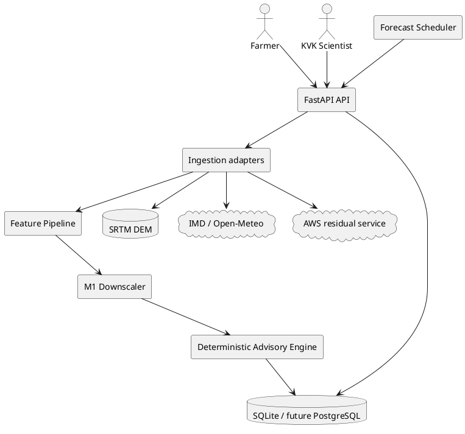

# SIH26074 production pilot architecture

## Operational flow

1. Scheduler refreshes each registered Panchayat.
2. Weather adapter normalizes five-day upstream data.
3. SRTM and AWS adapters provide terrain and previous-day residuals.
4. Feature engineering applies lapse-rate, cyclical, lag/lead and IDW residual features.
5. Versioned M1 artifact returns P10/P50/P90 and calibrated rainfall probabilities.
6. Physical constraints are applied before the response is exposed.
7. Deterministic advisory rules consume only validated forecast values.
8. Advisory JSON is persisted as `pending_review`.
9. KVK approves/edits/rejects through the authenticated endpoint.
10. Evaluation is generated separately from labelled AWS observations, preventing production inference from silently becoming its own test set.
